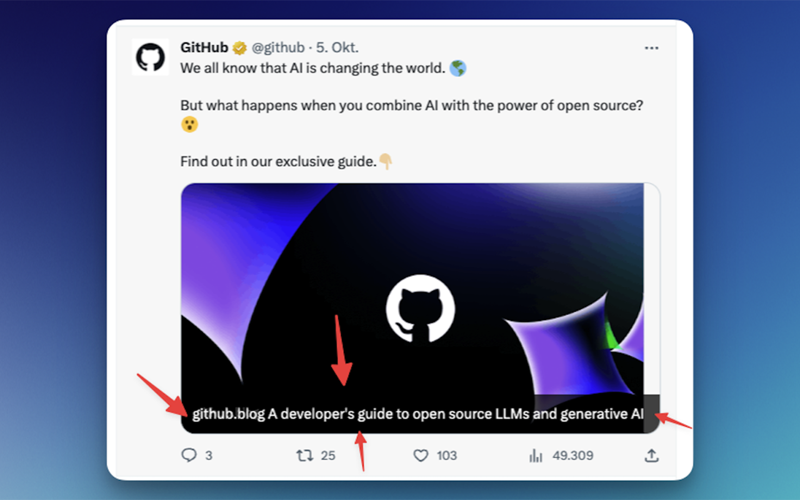

# Twitter Title Adder




This is a Chrome extension that adds titles again to Twitter.

[Chrome Web Store Link](https://chrome.google.com/webstore/detail/xtwitter-title-enabler/abgebpgocjbnbkojoieeeeejggdalfal?hl=de&authuser=0)

## Prerequisites

- [Google Chrome](https://www.google.com/chrome/) installed

## Build and Install

1. Clone the repository.

2. Navigate to the project root directory.

3. To build the project, run:

```sh
make build
```

4. To install the project, drag the .zip file into the  extensions view in Google Chrome (chrome://extensions/)

5. Open Twitter in Google Chrome. You should see the custom CSS applied.

6. To change the style, right-click the extension icon and select "Options".
